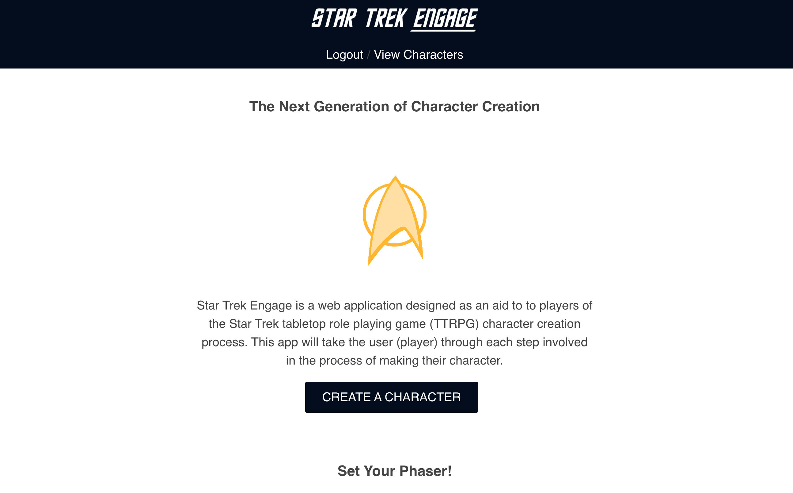

# STAR TREK ENGAGE

## Projet Details

### Screenshots

### SUMMARY OF APP
Star Trek Engage is a web application designed as an aid to to players of the Star Trek tabletop role playing game (TTRPG) character creation process. This app will take the user (player) through each step involved in the process of making their character. Buy using the framework and methods already established in the published rulebook by Modiphius Entertainment, using this app means the process of creating a character with compelling motivations and interesting background is even easier. At the end of the process the user of the app will be able to export their completed character sheet as a PDF, meaning they are 100% ready for the thrilling adventures that awaits them and the rest of their crew!

### Technology Used
FRONT END: HTML, CSS, JS, REACT

BACK END: NODE.JS, EXPRESS.JS, SQL

### LINK TO LIVE APP
https://star-trek-engage-client-app.now.sh/

## Scripts

Start the application `npm start`

Start nodemon for the application `npm run dev`

Run the tests `npm test`

## Deploying

When your new project is ready for deployment, add a new Heroku application with `heroku create`. This will make a new git remote called "heroku" and you can then `npm run deploy` which will push to this remote's master branch.